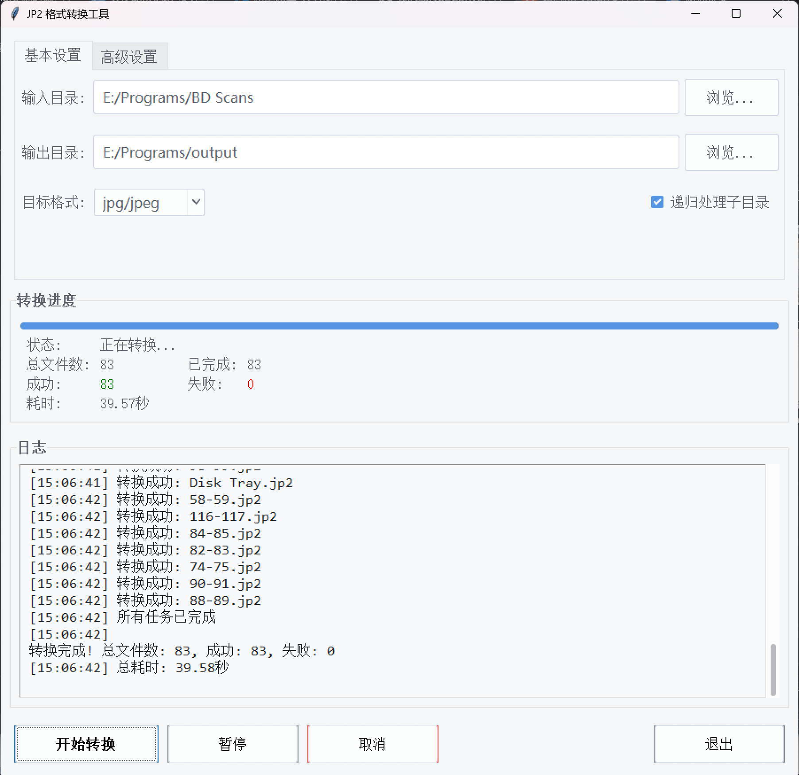

# JP2 格式转换工具

## 项目简介
专业的JP2图像格式转换工具，支持批量转换为JPG/PNG/BMP/TIFF等格式。提供直观的图形界面和命令行两种操作方式，支持多线程加速和图像质量调整。

## 功能特性
- ✔ 支持JP2转JPG/PNG/BMP/TIFF
- ✔ 图形界面(GUI)和命令行(CLI)双模式
- ✔ 批量转换和递归目录处理
- ✔ 多线程加速转换
- ✔ 图像质量调整（JPG格式）
- ✔ 图像尺寸调整

## 下载安装
### 预编译版本
[最新版本下载](https://github.com/tcirtsa/Jp2Converter/releases/latest) 包含：
- Windows x64 便携版 (.exe)

### 运行要求
- Windows系统需要安装 [VC++ 可再发行组件](https://aka.ms/vs/16/release/vc_redist.x64.exe)

## 使用说明
### 图形界面版
1. 点击"浏览"选择输入目录
2. 设置输出目录和转换格式
3. 调整质量/尺寸参数（可选）
4. 点击"开始转换"启动任务



### 命令行版
```bash
jp2_converter_cli 输入目录 输出目录 格式 [选项]
选项：
  -q 质量(1-100)  -r 宽 高  -w 工作线程数
```

## 贡献指南
1. Fork本仓库
2. 创建特性分支 (git checkout -b feature/your-feature)
3. 提交修改 (git commit -am 'Add some feature')
4. 推送分支 (git push origin feature/your-feature)
5. 创建Pull Request

## 开源协议
[MIT License](LICENSE)

## 问题反馈
请通过 [GitHub Issues](https://github.com/yourusername/Jp2Converter/issues) 提交问题报告